<h2 align="left">Hi 👋! My name is Prabhu. and I'm a Product/Program Manager, from Richardson, Texas</h2>

###

  
  

---

🚀 Product Management

<table>
  <tr>
    <td align="center"> Jira</td>
    <td align="center"> Confluence</td>
    <td align="center"> Figma</td>
    <td align="center"> GitHub</td>
    <td align="center"> Azure DevOps</td>
  </tr>
</table>

Roadmaps • PRDs • User Stories • Backlog Prioritization • RICE / MoSCoW

---

⚙️ Technical Program Management

<table>
  <tr>
    <td align="center"> Azure</td>
    <td align="center"> GitHub</td>
    <td align="center"> Jira</td>
    <td align="center"> Python</td>
    <td align="center"> MySQL</td>
  </tr>
</table>

Dependency Mapping • Technical Risk Management • Architecture Reviews • Release Readiness • Cross-Functional Delivery

---

📊 Project & Program Management

<table>
  <tr>
    <td align="center"> Jira</td>
    <td align="center"> Confluence</td>
    <td align="center"> Azure DevOps</td>
    <td align="center"> GitHub</td>
    <td align="center"> Figma</td>
  </tr>
</table>

Agile / Scrum • Sprint Planning • RAID Logs • RACI • Program Governance

---

📈 Data & Analytics

<table>
  <tr>
    <td align="center"> Python</td>
    <td align="center"> MySQL</td>
    <td align="center"> Pandas</td>
    <td align="center"> Azure</td>
  </tr>
</table>

SQL • Product Analytics • KPI Reporting • Forecasting • Data-Driven Decision Making

---

🛠️ Tools & Platforms

<table>
  <tr>
    <td align="center"> Jira</td>
    <td align="center"> Confluence</td>
    <td align="center"> Azure DevOps</td>
    <td align="center"> Figma</td>
    <td align="center"> GitHub</td>
  </tr>
</table>

---

<h3 align="left">🤝 Connect With Me</h3>

  
  

 

